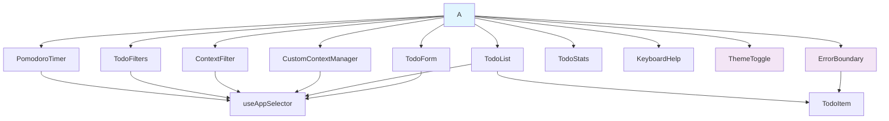
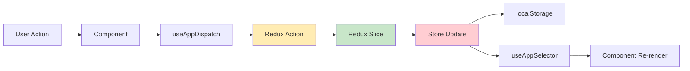
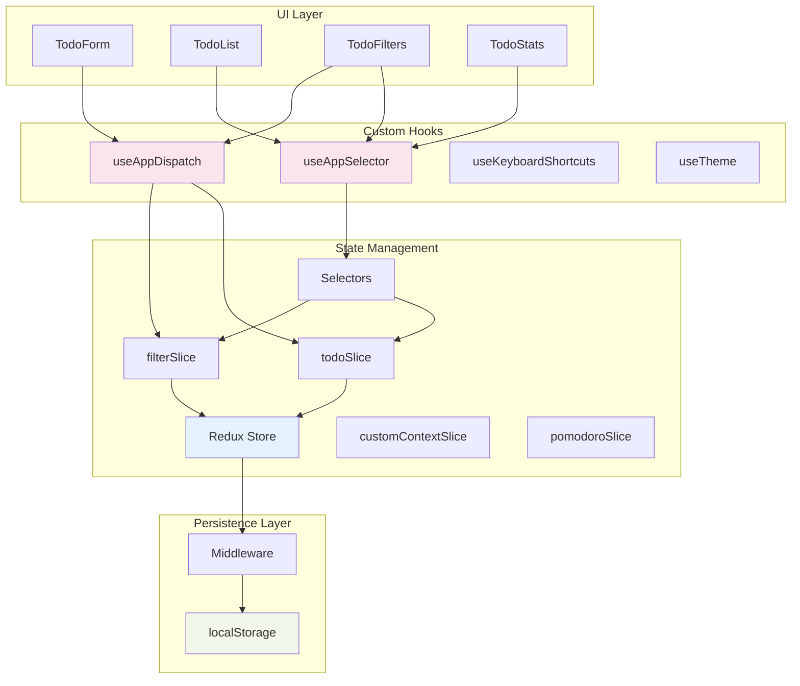

# Todo in Pomodoro Sauce 🍅

A modern, productivity-focused Todo application that combines task management with the Pomodoro Technique. Built with React 18, Redux Toolkit, and TypeScript, featuring a beautiful UI with smooth animations and comprehensive productivity tracking.

## ✨ Features

### 🍅 **Pomodoro Timer Integration**
- **25-minute focus sessions** with automatic break management
- **Beautiful timer interface** with real-time countdown and progress bar
- **One-click task focusing** - click the 🍅 button on any todo to start a session
- **Automatic break cycling** - 5-minute short breaks, 15-minute long breaks after 4 sessions
- **Productivity statistics** - track completed pomodoros, focus time, and cycles
- **Visual feedback** with pulsing animations during active sessions

### 📝 **Advanced Todo Management**
- **Modern React 18** with functional components and hooks
- **Redux Toolkit** for efficient state management
- **TypeScript** for type safety and better developer experience
- **Styled Components** for component-scoped styling with glassmorphism effects
- **Responsive Design** that works beautifully on all devices
- **Real-time Statistics** showing todo completion progress
- **Filter System** to view all, active, or completed todos
- **Smooth Framer Motion animations** throughout the interface
- **Drag & Drop** functionality to assign todos to Pomodoro sessions

### 🎯 **Getting Things Done (GTD) Integration**
- **8 Built-in GTD Contexts**: Inbox, @Calls, @Computer, @Errands, @Home, @Office, @Waiting For, Someday/Maybe
- **Custom Context Creation** - Create personalized contexts like @Shopping, @Gym, @Reading
- **Context-based Filtering** - Filter todos by specific contexts for focused workflow
- **Color-coded Context Tags** - Visual organization with unique colors and icons
- **Context Persistence** - Custom contexts saved automatically in localStorage
- **Seamless Integration** - Contexts work with all existing features (Pomodoro, drag-drop, filtering)

## 🚀 Quick Start

### Prerequisites

- Node.js 16+ 
- npm or yarn

### Installation

```bash
# Clone the repository
git clone https://github.com/your-username/todo-in-pomodoro-sauce.git

# Navigate to project directory
cd todo-in-pomodoro-sauce

# Install dependencies
npm install
# or
yarn install

# Start the development server
npm start
# or
yarn start
```

The app will open at [http://localhost:3000](http://localhost:3000)

## 🏗️ Architecture

This project follows modern React best practices with a feature-based folder structure and clean architecture principles.

### Component Architecture



### State Management Flow



### Data Flow Architecture



### Folder Structure

```
src/
├── components/              # Feature-based UI components
│   ├── App/                # Main application container
│   │   ├── App.tsx         # App component with global state
│   │   ├── App.test.tsx    # Comprehensive test suite
│   │   └── index.ts        # Barrel export
│   ├── TodoForm/           # Todo creation functionality
│   │   ├── TodoForm.tsx    # Form with validation & GTD context selection
│   │   └── index.ts
│   ├── TodoList/           # Todo display container
│   │   ├── TodoList.tsx    # List with empty state handling & drag-drop
│   │   └── index.ts
│   ├── TodoItem/           # Individual todo management
│   │   ├── TodoItem.tsx    # Item with toggle/delete/context display
│   │   └── index.ts
│   ├── TodoFilters/        # Filter state management
│   │   ├── TodoFilters.tsx # Filter buttons with active state
│   │   └── index.ts
│   ├── ContextFilter/      # GTD context filtering
│   │   ├── ContextFilter.tsx # Context filter buttons with icons
│   │   └── index.ts
│   ├── CustomContextManager/ # Custom GTD context management
│   │   ├── CustomContextManager.tsx # CRUD for custom contexts
│   │   └── index.ts
│   ├── TodoStats/          # Statistics display
│   │   ├── TodoStats.tsx   # Real-time todo statistics
│   │   └── index.ts
│   ├── PomodoroTimer/      # Pomodoro technique integration
│   │   ├── PomodoroTimer.tsx # 25-min timer with break management
│   │   └── index.ts
│   ├── KeyboardHelp/       # User experience enhancement
│   │   ├── KeyboardHelp.tsx # Modal with shortcut guide
│   │   └── index.ts
│   ├── ThemeToggle/        # Theme management
│   │   ├── ThemeToggle.tsx # Dark/light mode toggle
│   │   └── index.ts
│   └── ErrorBoundary/      # Error handling
│       ├── ErrorBoundary.tsx # Production error boundary
│       └── index.ts
├── store/                  # Redux Toolkit configuration
│   ├── slices/            # Domain-specific state slices
│   │   ├── todoSlice.ts   # Todo CRUD operations with GTD contexts
│   │   ├── filterSlice.ts # Filter state management with context filtering
│   │   ├── customContextSlice.ts # Custom GTD context management
│   │   └── pomodoroSlice.ts # Pomodoro timer state
│   ├── selectors/         # Memoized state selectors
│   │   └── todoSelectors.ts # Filtered todos with context support
│   ├── hooks.ts          # Typed Redux hooks
│   └── index.ts          # Store configuration & types
├── utils/                # Utility functions
│   └── gtdContexts.ts   # GTD context definitions and helpers
├── contexts/            # React contexts
│   └── ThemeContext.tsx # Theme provider and management
├── hooks/                # Custom React hooks
│   ├── useLocalStorage.ts # localStorage abstraction
│   ├── useKeyboardShortcuts.ts # Keyboard navigation
│   └── index.ts          # Hook exports
├── index.tsx             # Application entry point
├── index.css            # Global styles & theme variables
└── setupTests.ts        # Test configuration
```

### Key Architectural Decisions

#### 1. **Feature-Based Organization**
- Components grouped by feature rather than type
- Each component has its own folder with index.ts for clean imports
- Co-located tests and related files

#### 2. **Redux Toolkit Pattern**
```typescript
// Modern slice-based approach
const todoSlice = createSlice({
  name: 'todos',
  initialState,
  reducers: {
    addTodo: (state, action) => {
      // Immer handles immutability
      state.todos.push(newTodo);
    }
  }
});
```

#### 3. **Typed Redux Integration**
```typescript
// Type-safe hooks
export const useAppDispatch = () => useDispatch<AppDispatch>();
export const useAppSelector: TypedUseSelectorHook<RootState> = useSelector;
```

#### 4. **Memoized Selectors**
```typescript
// Performance optimization
export const selectVisibleTodos = createSelector(
  [selectTodos, selectFilter],
  (todos, filter) => filterLogic(todos, filter)
);
```

#### 5. **Persistence Strategy**
- Automatic localStorage sync via store subscription
- Graceful error handling for storage failures
- State rehydration on app initialization

#### 6. **Component Composition**
- Single responsibility principle
- Props drilling avoided through Redux
- Custom hooks for cross-cutting concerns

## 🛠️ Technology Stack

- **React 18** - Modern React with concurrent features
- **Redux Toolkit** - Official, opinionated Redux toolset
- **TypeScript** - Static type checking
- **Styled Components** - CSS-in-JS styling solution
- **Framer Motion** - Advanced animations and transitions
- **React Beautiful DnD** - Drag and drop functionality
- **React Icons** - Comprehensive icon library
- **React Testing Library** - Testing utilities
- **Create React App** - Build tooling and configuration

## 📦 Key Dependencies

```json
{
  "@reduxjs/toolkit": "^2.0.1",
  "react": "^18.2.0",
  "react-redux": "^9.0.4",
  "styled-components": "^6.1.8",
  "framer-motion": "^10.16.5",
  "react-beautiful-dnd": "^13.1.1",
  "react-icons": "^4.12.0",
  "typescript": "^5.2.2"
}
```

## 🧪 Testing

```bash
# Run tests
npm test
# or
yarn test

# Run tests with coverage
npm test -- --coverage
# or
yarn test --coverage
```

## 🏗️ Building for Production

```bash
# Create production build
npm run build
# or
yarn build

# Type check
npm run type-check
# or
yarn type-check
```

## 🎯 Modern React Patterns Used

- **Functional Components** with hooks instead of class components
- **Redux Toolkit** with createSlice for simplified Redux logic
- **TypeScript** for type safety and better IntelliSense
- **Custom Hooks** for reusable stateful logic
- **Memoized Selectors** with createSelector for performance
- **Feature-based Architecture** for better code organization
- **Styled Components** for component-scoped styling

## 🔄 State Management

The application uses Redux Toolkit with the following structure:

- **todoSlice**: Manages todo items with GTD context support (add, toggle, remove, context assignment)
- **filterSlice**: Manages visibility filters and GTD context filtering
- **customContextSlice**: Manages custom GTD contexts (CRUD operations, localStorage persistence)
- **pomodoroSlice**: Manages Pomodoro timer state (sessions, breaks, statistics)
- **Selectors**: Memoized selectors for derived state with context filtering
- **Typed Hooks**: Custom hooks for type-safe Redux usage

## 🎨 Styling Approach

- **Styled Components** for component-scoped CSS
- **Responsive Design** with mobile-first approach
- **Modern Color Palette** with consistent theming
- **Smooth Transitions** for better user experience

## 🚀 Performance Optimizations

- **Memoized Selectors** to prevent unnecessary re-renders
- **React.memo** for component optimization where needed
- **Code Splitting** ready with React.lazy
- **Bundle Analysis** available with source-map-explorer

## 📱 Browser Support

- Chrome (latest)
- Firefox (latest)
- Safari (latest)
- Edge (latest)

## 🤝 Contributing

1. Fork the repository
2. Create a feature branch (`git checkout -b feature/amazing-feature`)
3. Commit your changes (`git commit -m 'Add amazing feature'`)
4. Push to the branch (`git push origin feature/amazing-feature`)
5. Open a Pull Request

## 📄 License

This project is licensed under the MIT License - see the [LICENSE](LICENSE) file for details.

## 🙏 Acknowledgments

- Built with [Create React App](https://create-react-app.dev/)
- State management powered by [Redux Toolkit](https://redux-toolkit.js.org/)
- Styling with [Styled Components](https://styled-components.com/)
- Icons and inspiration from the React community

---

**Happy coding! 🎉**